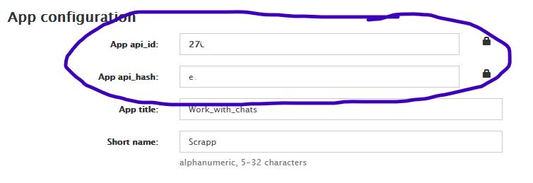

### Описание

Данный проект представляет собой скрипт на Python, использующий библиотеку Pyrogram для взаимодействия с Telegram API. Скрипт собирает информацию о чатах пользователя, включая их идентификаторы, типы и дополнительные данные, и сохраняет результаты в формате JSON и текстовые файлы.

### Функции

- `collect_data()`: Сбор всех ID чатов пользователя по категориям (BOT, GROUP, SUPERGROUP, CHANNEL, PRIVATE).
- `official_bots_channels()`: Нахождение всех официальных ботов и каналов, на которые подписан пользователь.
- `once_wrote()`: Логирование всех чатов, в которых пользователь писал хоть раз.
- `get_all_chats()`: Получение и обработка всех чатов и каналов пользователя.
 - `get_number_from_not_contact()`: Сбор номеров телефонов пользователей, с которыми вы общались, но которые не добавлены в контакты.

### Результаты
Результаты работы скрипта будут сохранены в следующих файлах:

- `yr_database.json`: Содержит ID чатов, сгруппированные по типам.
- `верифицированные каналы и боты.txt`: Список всех официальных ботов и каналов.
- `личные диалоги.txt`: Лог всех личных диалогов, в которых вы писали.
- `боты, супер-группа, группы.txt`: Лог всех групповых чатов и ботов.
- `телефонные номера не контактов.txt`: Номера телефонов пользователей, которые не являются вашими контактами.

### Запуск программы
1. Установить библиотеку `pyrogram` 
2. Скачать библиотеку `tgcrypto` (я заметил, что импортировать необязательно). Эта библиотека позволит быстрее выполнять запросы к тг
3. Перейти на сайт https://my.telegram.org/apps
4. Зарегистроваться, ввести данные для тг (название и прочее любые)
5. Скопировать данные 

6. Вставить в одноименные переменные в файле `config.ini`
7. Запустить файл `main.py`

